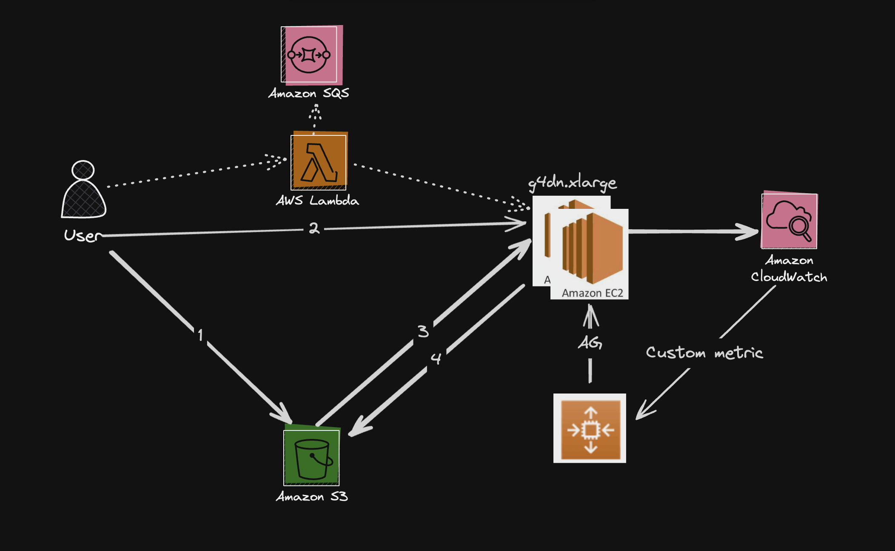

## System Design



1. User 는 S3 에 src 이미지를 업로드
2. User 는 아래와 같은 형식으로 API 서버 호출

```json
{
// 업로드한 소스가 있는 폴더의 S3 URI
  "Source Folder Path": "s3://pointcloud.test.until.20240607/test/src",
// 처리결과가 저장되는 폴더의 S3 URI
  "Target Folder Path": "s3://pointcloud.test.until.20240607/test/target",
  "Force Global Align": true,
  "Save Source To Result Folder": true,
  "Complete Type": 1,
  "File Size": 1,
  "Use GPU": true,
  "Use GPU For Voxel Regeneration": true,
  "Compensate Occlusion Align": true,
  "Compensate Occlusion Level": 1,
  "Reduce Roughness": 0,
  "High Resolution Merge Type": 1,
  "Apply High Resolution to Prep": true
}
```

3. API 서버는 요청을 아래와 같이 Custom AMI 환경에 맞게 변환 후 S3 로 부터 소스 다운로드 및 이미지 프로세싱 처리
```json
{
// EC2 Instance 환경의 소스 경로
  "Source Folder Path": "C:\\Metdit_AutoTest\src",
// EC2 Instance 환경의 결과 파일이 저장되는 경로
  "Target Folder Path": "C:\\Medit_AutoTest\target",

// 아래 나머지 설정은 요청바디로 동일
  "Force Global Align": true,
  "Save Source To Result Folder": true,
  "Complete Type": 1,
  "File Size": 1,
  "Use GPU": true,
  "Use GPU For Voxel Regeneration": true,
  "Compensate Occlusion Align": true,
  "Compensate Occlusion Level": 1,
  "Reduce Roughness": 0,
  "High Resolution Merge Type": 1,
  "Apply High Resolution to Prep": true
}
```
4. EC2 로컬에 저장된 결과를 요청된 결과 S3 위치로 업로드

Processing 중 api server 와 Medit_AutoTest.exe 의 로그는 cloud watch 로 실시간 업로드(해당 로그그룹은 variables.tf 에서 확인 및 변경 가능)
Processing 에 걸린 시간은 cloud watch metric 에 Instance Id / Job Id 디멘션으로 저장

---
## API spec

Description: This script is used to create a Flask API for pointcloud image processing tasks.
The API has the following endpoints:
1. POST /process: This endpoint is used to start a new image processing task. The request body should contain a JSON object with the following keys
   - "Source Folder Path": S3 URI of the source folder containing the images to be processed
   - "Target Folder Path": S3 URI of the target folder where the processed images will be saved
   - Other configuration parameters required for the image processing task
   The endpoint returns a JSON response with the job ID and status "started"
2. GET /job/<job_id>: This endpoint is used to get the status of a specific job identified by the job ID
   The endpoint returns a JSON response with the job ID and its status
3. GET /jobs: This endpoint is used to get the status of all active jobs
   The endpoint returns a JSON response with a list of job IDs and their statuses
4. GET /status/health: This endpoint is used for AWS EC2 Health Check
   The endpoint returns a JSON response with the status "ready"
---
## TBD

- [ ] 커스텀 AMI 개선
: 현재 4G 가 넘는 파일을 기 설치하여 대응하나 Study 를 위해 Medit_AutoTest 를 동적으로 EC2 에 deploy 하는 방식으로...

- [ ] 빠르게 진행하기 위해 python 으로 했으나 golang 같은 컴파일 언어로 변경 필요

- [ ] 같은 인스턴스에 같은 소스를 프로세싱하더라도 측정된 processing duration 의 범위가 신뢰되지 않음 (290 ~ 900)
: Windows 에서 가끔 python 서버를 띄우지 못하는 경우가 왕왕 발생 -.-
: 일관된 성능도 나오지 않음
: 가끔 Medit_AutoTest.exe 에서 멈추는 경우 발생
: 동시 작업 수에 따른 성능도 측정 필요 -> Autoscaling metric 으로 사용
: 프로세싱이 어느단계인지, 몇 % 진행되었는지 확인 필요

- [ ] AWS Autoscaling Group뿐 아니라 Target Group 의 트래픽 조절을
커스텀해야 함
: API server 에서 현재 부하 상태를 리턴해주는 Endpoint 노출
: Target Group 에서 ALB 로 부하를 해당 정보를 통해 트래픽 라우팅

- [ ] 성능 분석을 통해 CloudWatch 를 통해 보여주는 로깅 고도화 필요
: 외부에서 디버깅 레벨 조절 가능


- [ ] PoC 개선중 아이템
	- [ ] Traffic Routing
		- [ ] Lambda vs Target Group
	- [ ] Job Queue
	- [ ] 성능분석
		- [ ] Job 세부 성능 확인
			- [ ] Job state 별 로깅?
		- [ ] CloudWatch 로그 분리
			- [ ] 


